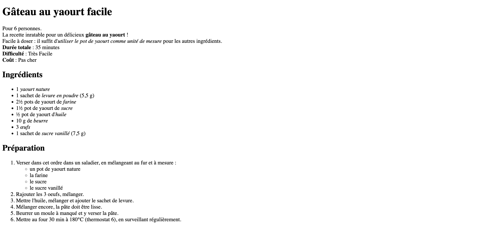

Formater du texte - Recette de cuisine
========================

## Objectif
Mettre en forme des informations, à partir d'un contenu qui vous est fourni, en utilisant et en structurant les éléments HTML appropriés.

## Instructions
Vous allez créer une page web présentant une recette de cuisine.
- Utilisez un **titre de niveau 1** pour le nom de la recette
- Ajoutez une description de la recette (balise **paragraphe**)
- Ajoutez un sous-titre (**titre de niveau 2**) _"Ingrédients"_ suivi d'une liste des ingrédients (**liste non ordonnée**)
- Ajoutez un sous-titre (**titre de niveau 2**) _"Préparation"_ suivi d'une liste des étapes de préparation (**liste ordonnée**)
Utiliser l'attribut `type` de la liste ordonnée pour spécifier le type de numérotation.



### Balises à utiliser
  - titres `h1`, `h2` etc.
  - paragraphes `p` et sauts de ligne `br`
  - liste ordonnée `ol` et non ordonnée `ul`, et éléments de liste `li`
  - contenu mis en avant (en gras) `strong` et en italique `em`

Vous allez devoir imbriquer des éléments html les uns dans les autres.
Pensez à indenter votre code pour le rendre plus lisible.

## Contenu de référence

> ## Gâteau au yaourt facile
> Pour 6 personnes.
> La recette inratable pour un délicieux **gâteau au yaourt** !
> Facile à doser : il suffit d'_utiliser le pot de yaourt comme unité de mesure_ pour les autres ingrédients.
> **Durée totale** : 35 minutes
> **Difficulté** : Très Facile
> **Coût** : Pas cher
> ### Ingrédients
> - 1 _yaourt nature_
> - 1 sachet de _levure en poudre_ (5,5 g)
> - 2½ pots de yaourt de _farine_
> - 1½ pot de yaourt de _sucre_
> - ½ pot de yaourt d'_huile_
> - 10 g de _beurre_
> - 3 _œufs_
> - 1 sachet de _sucre vanillé_ (7,5 g)
>
> ### Préparation
> 1. Verser dans cet ordre dans un saladier, en mélangeant au fur et à mesure :
>     - un pot de yaourt nature
>     - la farine
>     - le sucre
>     - le sucre vanillé
> 2. Rajouter les 3 oeufs, mélanger.
> 3. Mettre l'huile, mélanger et ajouter le sachet de levure.
> 4. Mélanger encore, la pâte doit être lisse.
> 5. Beurrer un moule à manqué et y verser la pâte.
> 6. Mettre au four 30 min à 180°C (thermostat 6), en surveillant régulièrement.


Etape par étape
-------------------

### 🔁 La routine

1. Cloner le projet avec Github Desktop.
2. Créer un fichier `index.html`
3. Ajouter le squelette HTML de base : dans VS Code, appuyez sur `!` puis sur `Entrée`. 
Pour l'instant, concentrons-nous


```html
<!DOCTYPE html>
<html lang="en">
<head>
  <meta charset="UTF-8">
  <meta name="viewport" content="width=device-width, initial-scale=1.0">
  <title>Document</title>
</head>
<body>
  
</body>
</html>
```

## 🚀 Comment tester votre code

Avant le premier test, lancez la commande suivante pour installer les dépendances du projets.

```bash
npm install
```


Exécutez ensuite la commande suivante pour lancer les tests :
```bash
npm run test
```

Vous pouvez la lancer autant de fois que vous le souhaitez.
N'hésitez donc pas à l'utiliser à chaque fois pour vérifier votre code au fur et à mesure de votre progression.

Tous les tests doivent passer pour obtenir la totalité des points ! ✅

Pour publier votre travail, vous devez ensuite faire un `push` sur votre repository.
